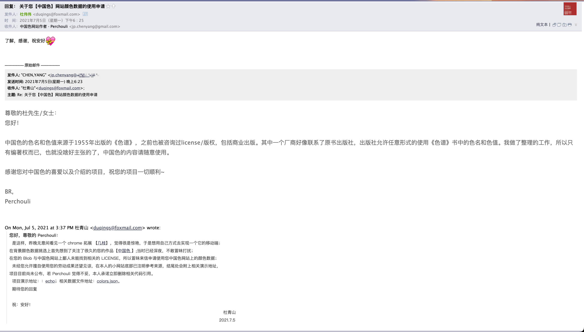
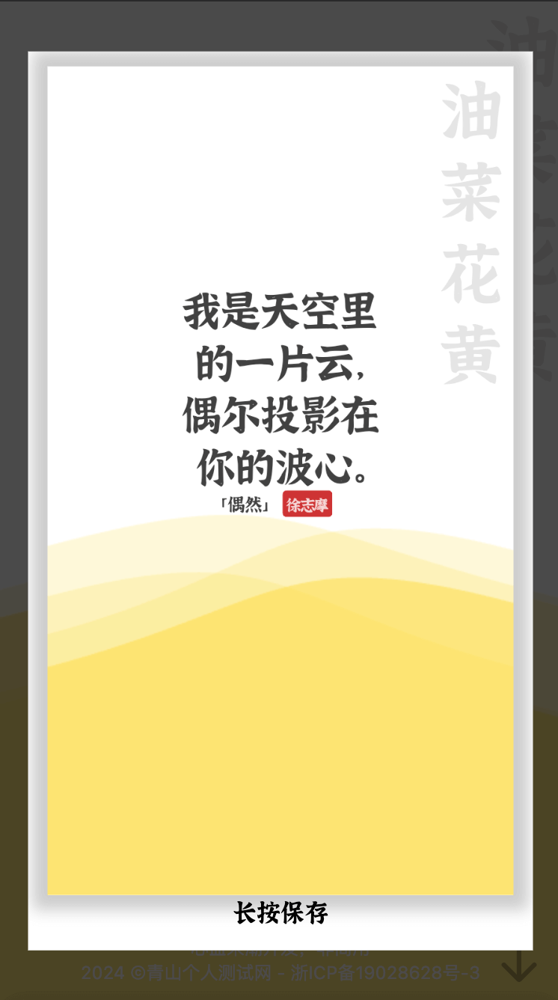

# Echo

## 大概

  这个项目大概是2021年7月份中旬左右开发的吧，起因是因为某天无意间看到一个Chrome插件：[几枝(GitHub)](https://github.com/unicar9/jizhi)，很惊艳，当时刚工作没多久，就想着是否可以自己写一个，于是当天下班到家就开始捣鼓

  技术原因，依稀记得弄到凌晨三点多才结束第一版的代码（也是最后一版本）

  那个时候想着图方便，没用脚手架之类的东西，直接cdn一把梭哈哈哈哈，所以现在看着代码很乱

  几天维护服务器，无意间看到这个小项目，突然一阵愣神，倒是想起了那年发生的不少事哈哈哈哈，时间的魅力

  不感怀了，给无意间看到的伙伴推荐一下：

  原型项目：[几枝(GitHub)](https://github.com/unicar9/jizhi)

  颜色：[中国色](http://zhongguose.com/#qingfanlv)

  颜色数据授权：
  

  推荐大家去康康`几枝`，配置多选择多，比这个`echo`小玩意精致多了哈哈哈

## 截图

> 放几张 echo 的截图,

**如果涉及到侵权请及时联系我 duqings@foxmail.com**

  

  
